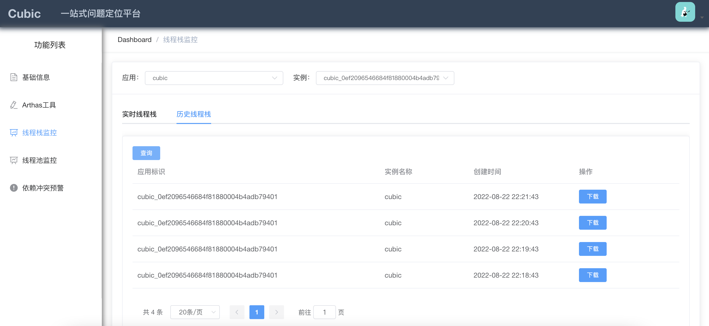

<h3>您的star是我继续前进的动力，如果喜欢请右上角帮忙点个star</h3>

## Cubic是什么
  
`Cubic` 一站式问题定位平台，以agent的方式无侵入接入应用，提供各种指标，动态线程堆栈追踪，完整集成arthas功能模块，致力于应用级监控，帮助开发人员快速定位问题。

官方网站：https://cubic.jiagoujishu.com

Gitee: https://gitee.com/dromara/cubic

Github: https://github.com/dromara/cubic

Demo: http://43.138.50.220:6080

特性：
- 1、兼容性：整体监控不管你是IDC、ECS、Docker部署，都可完美兼容
- 2、易用： 无需任何配置，开箱即用，基于agent无侵入接入，升级应用端无感知
- 3、强大： 支持对应用的基础监控、堆栈监控、线程池监控等等
- 4、高扩展：提供良好的扩展接口，给你自主选择

## 开发环境部署

**只需两步：**
 - 执行cubic-proxy -> resources -> db -> init.sql 创建表
 - 执行运行脚本 build-start.sh 打包部署应用

**如有问题？**

请看Q/A章节y
 
 
## 文档
- [快速开始](docs/cn/quick_start.md)
- [远程主机命令下发（动态arthas）](docs/cn/arthas_tools.md)

## 结构
| cubic-agent      | 应用数据采集agent                                            |
| ---------------- | ------------------------------------------------------------ |
| config           | 存放agent配置文件                                            |
| cubic-proxy      | 代理应用，用于接收agent数据                                  |
| cubic-proxy-common      | 公共基础参数                                 |
| cubic-proxy-websocket      | 代理应用，用于接收页面与proxy之间的数据通信                             |
| cubic-ui         | 页面UI，提供前端各种功能展示,打包完 将dist目录数据拷贝到cubic-proxy |
| docs             | 文档                                                         |
| scripts          | 包含打包脚本、启动脚本                                       |
| agent-dist       | 存放打包后的agent完整组件                                    |
| agent-proxy-dist | 存放打包后 proxy 部署 jar                                    |
| arthas-dist      | 用于支持arthas命令集                                         |

## 技术体系：
- 基于最新Spring Boot 整体技术栈
- 认证模块是基于Spring Boot Security JWT 技术
- WebShell 基于 Vue Xterm 、Websocket、Netty 技术
- Proxy 与 agent 通信基于Netty 、GRPC

## 功能

#### 已完成
| 功能                 |
| -------------------- |
| 权限认证            |
| 实例列表             |
| 实例心跳监测         |
| 实例基础信息采集     |
| 服务器信息采集       |
| JVM基础信息采集      |
| 启动参数采集         |
| 依赖包检测           |
| arthas动态命令集支持 |
| 历史线程栈获取（分钟级） |
| 实时线程栈获取 |
| 线程池监控 |

 
 

## 功能展示

#### 实例中心（展示当前实例信息）

#### 基础信息（点击实例-》展示当前实例的基础信息）

#### 依赖监控（点击实例-》展示当前实例的依赖包信息）

#### Arthas命令操作

 
     

#### 线程池监控

#### 实时线程栈

#### 历史线程栈

## Q&A
**1、Q : 为什么页面迭代这么慢？**

A : 因为目前自己抽时间在写，所以前端UI 有些小BUG ,功能、部署、脚本等等都在完善中，马上准备使用最新的VUE 那一套来进行页面的输出迭代了，欢迎各位大牛贡献代码。

**2、Q : 为什么最近几个月未更新？**

A : 因为换工作等问题导致的，后面会严格按照每月一个大版本进行更新

**3、Q : 编译后protobuf文件找不到？**

A : 重新执行下 mvn compile

**4、Q : 环境依赖**

A : JDK 1.8、 MySQL 5.5+

**5、 Q : 报JDK版本错误或tools.jar不存在问题**

A : cubic使用的java为JAVA_HOME/bin/java, 需要JDK8及以上，但"不要求"与目标应用的JVM使用相同的JDK版本。

cubic需要依赖JAVA_HOME/lib/tools.jar

JAVA_HOME的定位，通过读取环境变量JAVA_HOME，如果没有定义，则尝试通过"which java"定位java从而获得相对路径。

可通过echo $JAVA_HOME 查看当前配置

**6、Q : 如果linux 上出现java.lang.NoClassDefFoundError: com/sun/tools/attach/VirtualMachine**

A: 此时`echo $JAVA_HOME `发现也已经配置，请在应用启动参数上增加 `-Xbootclasspath/a:$JAVA_HOME/lib/tools.jar`

**7、Q : 下载后有些编译报错 **

A: 不要怕，可以使用scripts里面的build.sh打包下即可。如果还有报错，点下IDEA的build(绿锤子)
## 组织
 让我们一起学习成长，关注公众号获得每日一个知识点的储备，让我们一起成长

#### 知识获取

 

#### 问题交流
[点击链接加入群聊【Cubic开源交流群】](https://jq.qq.com/?_wv=1027&k=eS6c8HkS)

 

#### 欢迎加入社区星球

 
